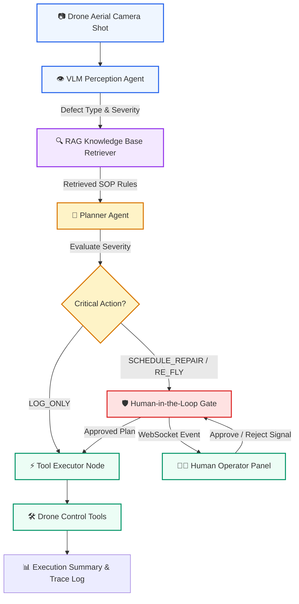

# Autonomous Drone Fleet Inspection — Multi-Agent System

An autonomous aerial drone inspection system featuring a **simple light-themed user interface**, multi-agent graph orchestration (VLM perception, local RAG knowledge base retrieval, reasoning planner agent), mock drone tool execution, real-time WebSocket telemetry streaming, and a **Human-in-the-Loop (HITL)** safety approval gate.

---

## 🏗️ System Architecture



### Component Details

| Pipeline Layer | Component | Description |
|---|---|---|
| **Perception** | `vlm_agent.py` | Receives aerial solar panel photo, evaluates cell visual features, identifies defect type (micro-cracks, dust, hotspots, debris, clean), and calculates confidence & severity level. |
| **Knowledge Retrieval (RAG)** | `vector_store.py` | Performs TF-IDF / vector similarity search over maintenance manuals (`maintenance_manual.md` & `safety_protocols.md`) to fetch exact standard operating procedures (SOP). |
| **Reasoning & Planning** | `planner_agent.py` | Synthesizes visual inspection output with retrieved SOP rules to formulate the action plan (`LOG_ONLY`, `SCHEDULE_REPAIR`, `RE_FLY`). |
| **Safety Check (HITL)** | `hitl_gate.py` | Enforces safety policy by pausing high-severity actions (`SCHEDULE_REPAIR` / `RE_FLY`) and streaming approval prompts to the human operator over WebSockets. |
| **Tool Execution** | `drone_tools.py` | Invokes mock drone fleet dispatches (`flag_for_repair`, `reschedule_flight`, `log_report`) upon approval. |
| **Observability** | `tracing.py` | Archives step-by-step execution telemetry logs with optional LangSmith export hooks. |

---

## 🌟 Key Highlights

- **Clean Light-Themed Dashboard**: Designed with a soft off-white slate background (`#f8fafc`), clean cards, responsive thumbnail selector, and clear status badges (no dark colors).
- **Zero-Dependency Fallback**: Operates out of the box with zero external setup, with seamless upgrade path when OpenAI or Gemini API keys are configured in `.env`.
- **Real-Time Streaming**: Full WebSocket telemetry updates for live inspection feedback.

---

## 🚀 Quick Start Guide

### 1. Install Dependencies
```bash
pip install -r requirements.txt
```

### 2. Run Application Server
```bash
python3 -m uvicorn backend.main:app --port 8000
```
Open your browser at **`http://localhost:8000`**.

---

## 🧪 Running Automated Tests

Run the pytest suite:
```bash
python3 -m pytest tests/test_workflow.py
```

---

## 📁 File Structure

```
.
├── README.md
├── requirements.txt
├── .env.example
├── .gitignore
├── .vscode/
│   └── launch.json               # One-click F5 debug config
├── data/
│   ├── generate_images.py
│   ├── sample_images/            # Aerial solar panel sample shots
│   └── knowledge_base/           # RAG SOP documents
│       ├── maintenance_manual.md
│       └── safety_protocols.md
├── backend/
│   ├── main.py                   # FastAPI server & REST/WebSocket routes
│   ├── config.py                 # Configuration settings
│   ├── memory/
│   │   └── vector_store.py       # Knowledge Base search retriever
│   ├── perception/
│   │   └── vlm_agent.py          # VLM defect analyzer
│   ├── agents/
│   │   ├── planner_agent.py      # Reasoning planner agent
│   │   └── hitl_gate.py          # Human-in-the-loop safety gate
│   ├── tools/
│   │   └── drone_tools.py        # Mock drone execution tools
│   ├── graph/
│   │   └── workflow.py           # Multi-agent state machine workflow
│   └── observability/
│       └── tracing.py            # Telemetry tracing & LangSmith integration
├── frontend/
│   ├── index.html                # Light-themed single-page dashboard layout
│   ├── css/
│   │   └── style.css             # Light theme styling
│   └── js/
│       ├── api.js                # REST API client
│       ├── socket.js             # WebSocket streaming manager
│       └── app.js                # UI application logic
└── tests/
    └── test_workflow.py          # Pytest suite
```
